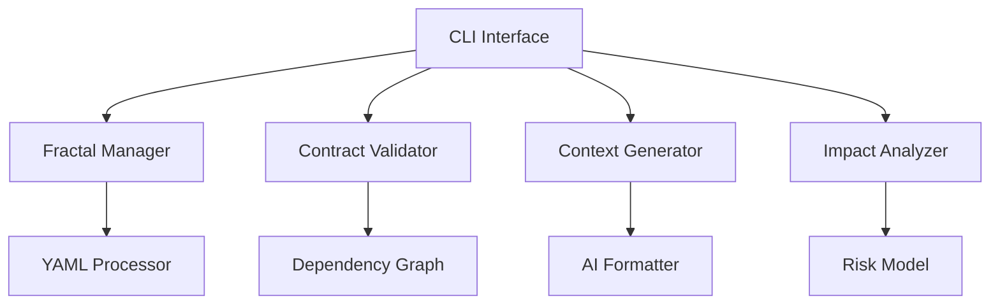

# MVP Specification: FractalCode CLI Tool

## 1. Overview
**Purpose**: Enable LLM agents to manage codebases using Code Fractalization Protocol principles  
**Key Capabilities**:
- Fractal component management
- Contract-driven development
- AI-friendly context generation
- Change impact prediction
- Codebase decomposition analysis

## 2. Core Features

### 2.1 Fractal Management
**Command**: `fractal init <name> [--parent]`  
Creates new fractal component with:
```
/my-component/
  implementation/
    src/
    tests/
  data/
    config.yaml
    resources/
  knowledge/
    context.yaml
    contracts/
      interface.yaml
      behavior.yaml
      resource.yaml
```

### 2.2 Contract System
**Command**: `fractal contract validate <path>`  
Validates YAML contracts:
```yaml
# interface.yaml
name: PaymentProcessor
version: 1.0.0
inputs:
  - name: transaction
    type: TransactionData
    flexible: false
outputs:
  - name: receipt
    type: Receipt
    optional: true
extension_points:
  - currency_support
```

### 2.3 Code Decomposition
**Command**: `fractal analyze <path> --output=decomposition-plan.yaml`  
Uses heuristic analysis to suggest component boundaries:
```yaml
components:
  - name: UserService
    cognitive_complexity: 0.78
    dependencies:
      - AuthService
      - Database
    decomposition_advice: "Split payment processing into sub-fractal"
```

### 2.4 Context Generation
**Command**: `fractal context generate <path> --for-ai`  
Produces AI-ready context summary:
```json
{
  "component": "PaymentService",
  "contracts": {
    "interface": ["processPayment", "refundTransaction"],
    "dependencies": ["CurrencyConverter@1.2.x"]
  },
  "decisions": [
    {
      "date": "2023-11-20",
      "rationale": "Chose eventual consistency for payment tracking",
      "alternatives_considered": ["Strong consistency with 2PC"]
    }
  ]
}
```

### 2.5 Change Impact Analysis
**Command**: `fractal impact --change=payment-api.yaml`  
Uses dependency graph analysis:
```text
Impact Report for payment-api.yaml:
- High risk: CurrencyConverter (v1.2 incompatible)
- Medium risk: TransactionHistoryService
- Affected tests: PaymentTests.Scenario3
Recommendations:
1. Update CurrencyConverter to v1.3+
2. Add contract negotiation clause C-203
```

## 3. Technical Specifications

### 3.1 Architecture


### 3.2 Data Models

**Fractal Context**:
```csharp
class FractalContext {
    string Name { get; set; }
    List<CodeContract> Contracts { get; set; }
    List<Dependency> Dependencies { get; set; }
    DecisionHistory Decisions { get; set; }
    VersionTimeline Versions { get; set; }
}
```

**Code Contract**:
```csharp
class CodeContract {
    ContractType Type { get; set; }
    string Name { get; set; }
    List<ContractParameter> Inputs { get; set; }
    List<ContractParameter> Outputs { get; set; }
    FlexibilityProfile Flexibility { get; set; }
}
```

## 4. Usage Examples

### 4.1 Creating Component Hierarchy
```bash
# Create core service
fractal init CoreServices --template=microservice

# Add sub-component
fractal init PaymentProcessor --parent=CoreServices
```

### 4.2 AI-Assisted Refactoring
```bash
# Generate context for LLM
fractal context generate ./AuthService --for-ai > auth-context.json

# After LLM proposes change:
fractal impact --change=auth-modifications.yaml
```

## 5. Quality Attributes

1. **Extensibility**: Plugin architecture for new contract types
2. **Performance**: Analyze 10k LOC in <5s
3. **AI Readiness**: Context summaries <5KB for GPT-4
4. **Accuracy**: 90%+ valid contract validations

## 6. Roadmap

| Version | Features |
|---------|----------|
| 1.0     | Core fractal management + contract system |
| 1.1     | GitHub integration + PR analysis |
| 2.0     | ML-powered impact prediction |

## 7. Configuration

**fractal.config.yaml**:
```yaml
analysis:
  cognitive_complexity_threshold: 0.65
  max_dependency_depth: 5
ai:
  context_presets: 
    - "decision_history"
    - "contract_summary"
  max_token_length: 4096
```

## 8. Error Handling

**Common Error Cases**:
```text
E001: Contract violation in PaymentService:processPayment
- Missing output guarantee: transactionId
- Required by: OrderService@1.2

E002: Decomposition warning in UserService
- Cognitive load exceeds threshold (0.72/0.65)
- Suggested split: EmailNotifications, ProfileManager
```

## 9. Development Guide

**Key Dependencies**:
- YamlDotNet for contract parsing
- QuickGraph for dependency analysis
- ML.NET for impact prediction (v2)
- Roslyn for C# analysis

**Build Command**:
```bash
dotnet publish -c Release -r win-x64 --self-contained
```

This MVP specification provides LLM agents with structured code management capabilities while maintaining fractal protocol principles. The console-based approach enables easy integration into CI/CD pipelines and AI agent workflows.